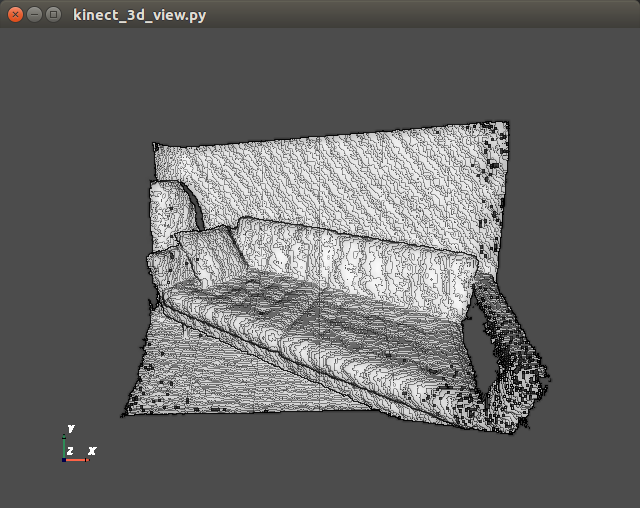
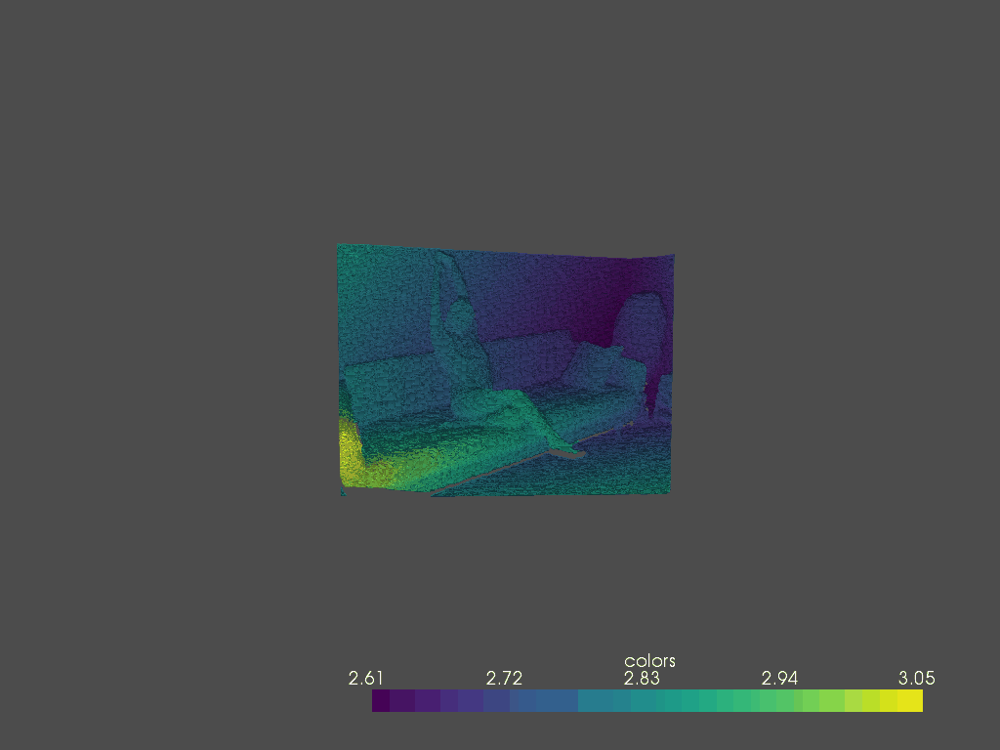

# kinect_point_cloud

## About

Draws real time 3D point cloud with kinect. The point cloud can be exported as .ply file, processed later with a viewer (included too).

<p align="center"> 
</a>
</a>
</p>


## Pre-reuisites

The folowing libraries must be installed over pip to run this software (for python >= 3.5):
- pip3 install opencv-python - used to do the depth information to 3D projection
- pip3 install pyvista and pyvistaqt - 3D visualization library, used to visualize the 3D data
- pip3 install PyQt5 - needed as frontend for pyvista
- pip3 install freenect - library to access kinect RGB-D data

## Command line parameters

The first ```kinect_3d_view.py``` file is the real time kinect data viewer. Uses freenect library to receive the frames from the RGB-D kinect camera and uses [pyvista](https://www.pyvista.org/) + [PyQt5](https://www.riverbankcomputing.com/software/pyqt/) as GUI to visualize it. Interaction is over the mouse. Command line options:

```
python3 kinect_3d_view.py --help
usage: kinect_3d_view.py [-h] -camid camera

optional arguments:
  -h, --help     show this help message and exit
  -camid camera  usb port on which kinect is connected, camid=[None,0,1,2,3],
                 default=None
```
When the GUI is running, there is a save command available in the menu, to save the current view as .ply output.


The ```ply_view.py``` file is a very simple ply viewer program, using the pyvista built in functions. The program provide also an animated gif generation, see command line options.
```
python3 ply_view.py --help
usage: ply_view.py [-h] -f file [-o orbit] [-cp camposition]

optional arguments:
  -h, --help       show this help message and exit
  -f file          filename.ply, load a .ply file
  -o orbit         [0, 1] creat animated gif, orbiting over the .ply objects
  -cp camposition  camera position, default [(0, -0.5, 5.0), (0.0, 0.0, 3.0),
                   (0, 1, 0)]

```


## Resurces

- [pyvista docs](https://docs.pyvista.org/)
- [Technical information from kinect](http://wiki.ros.org/kinect_calibration/technical)
- [Polygon File Format .ply](https://en.wikipedia.org/wiki/PLY_(file_format)) and [here](http://paulbourke.net/dataformats/ply/)
- [Kinect Calibration info](http://burrus.name/index.php/Research/KinectCalibration)

/Enjoy.
